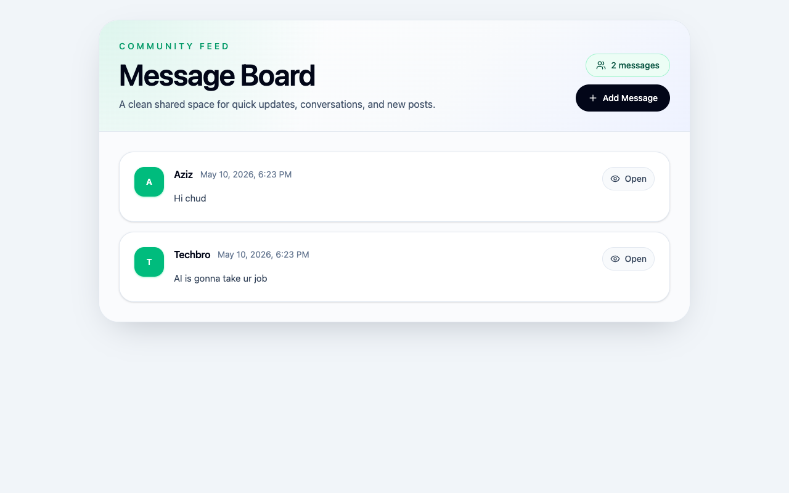

# Message Board

A small server-rendered message board built to practice **Express and EJS**, storing
posts in PostgreSQL (rather than in-memory) with server-side validation and post detail
pages.

🔗 **Live demo:** [message-board-six-sigma.vercel.app](https://message-board-six-sigma.vercel.app/)



## Features

- Message feed with reusable EJS partials and individual detail pages by id.
- Post-creation form wired through Express routes, controllers, and validation.
- PostgreSQL data layer for messages that persist across sessions.
- Tailwind-styled views.

## Tech stack

Node.js · **Express** · **PostgreSQL** (`pg`) · EJS · `express-validator` · Tailwind CSS

## Getting started

```bash
npm install
npm run db:init      # initialize the database schema
npm run dev          # Express server + Tailwind watch (concurrently)
```

Production-style start: `npm start`.

### Environment variables

Set in a local `.env` (gitignored). Variable **names** only:

| Variable | Used for |
|---|---|
| `POSTGRES_URL` | PostgreSQL connection string |
| `PORT` | Server port (optional) |

## What I practiced

Moving state from **in-memory to a real database**, building Express routes/controllers
with EJS templating, and validating user input server-side.

## License

Odin Project coursework — original implementation by Aziz Umarov.
